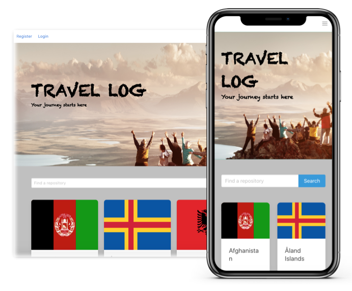

# Travel Log App
###  General Assembly, Software Engineering Immersive



## Overview
The concept behind travel log app allows users to register, creating their own profile, where they can check off and track all of their previous travel destinations. This is a full-stack application built using the Django REST framework with a PostgreSQL database and a React front-end.

I'm continueing to work on the travel log app to resolve the remaining issues I've had with the user's profile and look forward to showcasing the finished product!

## Brief

* Choose to work solo or in a team
* **Build a full-stack application** by making your own backend and your own front-end
* **Use a Python Django API** using Django REST Framework to serve your data from a Postgres database
* **Consume your API with a separate front-end** built with React
* **Be a complete product** which most likely means multiple relationships and CRUD functionality for at least a couple of models
* **Implement thoughtful user stories/wireframes** that are significant enough to help you know which features are core MVP and which you can cut
* **Have a visually impressive design** to kick your portfolio up a notch and have something to wow future clients & employers. 
* **Be deployed online** so it's publicly accessible.


## Technologies used
- HTML
- SCSS
- Python
- Django
- PostgreSQL
- JavaScript (ES6)
- React.js
- React Map GL (Mapbox)
- FileStack React
- React Toastify
- Webpack
- Dotenv
- Heroku
- Git and GitHub
- Trello
- Bulma

## Approach

### Back-end

### Models

### JWT_AUTH

As part of Django’s default authentication, a default user is already available for use. However, this default model has attributes which accepts only a small number of fields and only one of which is required as true. For this reason, we decided to extend the original model: 

```js
class User(AbstractUser):

    email = models.CharField(max_length=50, unique=True)
    first_name = models.CharField(max_length=100)
    last_name = models.CharField(max_length=100)
```

This customised model has three fields; email, first name, and last name. Email is already provided by Django’s default model. I  specified unique as also being **true**, disabling users to register with the same username and prompting the error message shown.

### Locations

I then had to create a locations model using data extracted from a country REST API. In order to display the user's previous travel destinations on an interactive map, I need the longitude and latitude to feature in the model.

```js
class PreviousLocation(models.Model):
  country = models.CharField(max_length=50)
  country_code = models.CharField(max_length=3)
  longitude = models.FloatField()
  latitude = models.FloatField()
  visitors = models.ManyToManyField(
    User,
    related_name='previous_locations',
    blank=True
  )

  def __str__(self):
    return f'{self.country}'
```

### Serializer

Now that the models are created, I needed to create serializers to convert them into JSON formatting. This was necessary in order for Django to communicate with the PostgreSQL database. The purpose of the serializers is simply converting data. In the database, data is stored differently to how it needs to be rendered for the API endpoints and is necessary to be able to display data that is clear to those who use the API. The serializers also validate before it is stored into the database, ensuring all required fields are submitted appropriately. 

```js
class ValidateSerializer(serializers.ModelSerializer):

    password = serializers.CharField(write_only=True)
    password_confirmation = serializers.CharField(write_only=True)

    def validate(self, data):

        password = data.pop('password')
        password_confirmation = data.pop('password_confirmation')

        if password != password_confirmation:
            raise serializers.ValidationError({'password_confirmation': 'Passwords do not match'})

        try:
            validations.validate_password(password=password)
        except ValidationError as err:
            raise serializers.ValidationError({'password': err.messages})

        data['password'] = make_password(password)
        return data

    class Meta:
        model = User
        fields = ('username', 'email', 'password', 'password_confirmation',)


class UserSerializer(serializers.ModelSerializer):

    class Meta:
        model = User
        fields = ('username', 'email', 'first_name', 'last_name', 'previous_locations')

        extra_kwargs = {
          'first_name': {'required': False},
          'last_name': {'required': False},
          'previous_locations': {'required': False}
        }

class PopulatedUserSerializer(serializers.ModelSerializer):

    previous_locations = PreviousLocationSerializer(many=True)

    class Meta:
        model = User
        fields = ('username', 'email', 'first_name', 'last_name', 'previous_locations')
```
## Views

Now being able to store and access our data that is viewable, we were now able to look at how our API information would return our data. I needed to implement the Django REST framework to create the views to render the backend data and CRUD functionality. 

For the JWT_AUTH I needed three views; register, login, and profile view.

When users submit their information in the register form it creates a POST request. Providing the data is valid using the serializer, it's passed through this endpoint and saved into the database. If the data is invalid, the user will recieve an error message displayed in the frontend. 

```js
class RegisterView(APIView):

    def post(self, request):
        serializer = ValidateSerializer(data=request.data)

        if serializer.is_valid():
            serializer.save()

            return Response({'message': 'Registration successful'})

        return Response(serializer.errors, status=422)
```

Once users have successfully registered, they will be able to login to have access their user profile. However, this endpoint also decifiers if the user has already registered using the **get_user** function by checking if the email address requested is within the database. If this is passed, the POST request will also run the **check_password** function provided by Django’s default user authentication. If the data matches a valid user, the user is given a JSONWebToken which is stored into the localStorage through the frontend and passes the **isAuthenticated** permission. 

```js
class LoginView(APIView):

    def get_user(self, username):
        try:
            return User.objects.get(username=username)
        except User.DoesNotExist:
            raise PermissionDenied({'message': 'Invalid credentials'})

    def post(self, request):

        username = request.data.get('username')
        password = request.data.get('password')

        user = self.get_user(username)
        if not user.check_password(password):
            raise PermissionDenied({'message': 'Invalid credentials'})

        token = jwt.encode({'sub': user.id}, settings.SECRET_KEY, algorithm='HS256')
        return Response({'token': token, 'message': f'Welcome back {user.username}!'})
```

All registered users are given their own profile. Here their checked off travel destinations will be displayed. This is the only endpoint whereby permissions have been enabled and has a single GET endpoint to get the user made the request. This utilises the PopulateUserSerialiser to pull the data.  

```js
class ProfileView(APIView):

    def get(self, request):
        user = User.objects.get(pk=request.user.id)
        serialized_user = PopulatedUserSerializer(user)
        return Response(serialized_user.data)
```

I also required a locations list view, where users could seearch through every country and check off their locations, adding them to their profile to be displayed on the map.

```js
class PreviousLocationListView(APIView):

  permission_classes = (IsAuthenticated, )

  def post(self, request):

    request.data['visitors'] = (request.user.id, )
    previous_locations = PreviousLocationSerializer(data=request.data)
    if previous_locations.is_valid():
      previous_locations.save()
      return Response(previous_locations.data, HTTP_201_CREATED)
    return Response(previous_locations.errors, HTTP_422_UNPROCESSABLE_ENTITY)
```

### On-Going Comments and Bugs
To display the user's previous travel destinations on their profile page using Mapbox has proved challenging. I'm continueing to resolve the bugs to successfully pass the information and display the maps correctly.

Although the project has bugs regarding the user profile view, having taken on the project solo, I feel I've gained valuable experience through constructing the full-stack app. As opposed to woring within a group, where I may have only worked on a few focussed elements of a project, I'm glad I took the opportunity to take it on solo, covering and experiencing the effects and valuable influences of each element.  